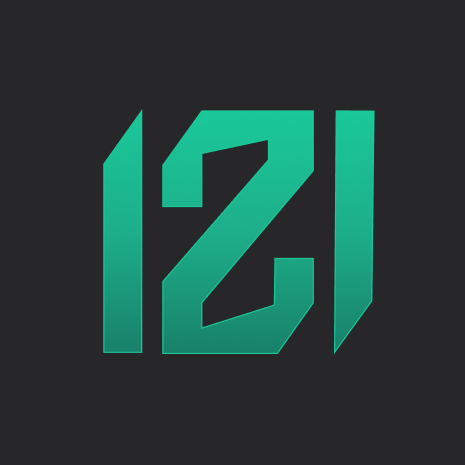

  

<h3 align="center">Hi there! I'm CPL121 </h3>

    

<!-- <picture>
  <source media="(prefers-color-scheme: dark)" srcset="https://raw.githubusercontent.com/cpl121/cpl121/output/github-contribution-grid-snake-dark.svg">
  <source media="(prefers-color-scheme: light)" srcset="https://raw.githubusercontent.com/cpl121/cpl121/output/github-contribution-grid-snake.svg">
  
</picture> -->

### ⚡ Tech Stack:
         

---

 

### 🌐 Socials:
   

